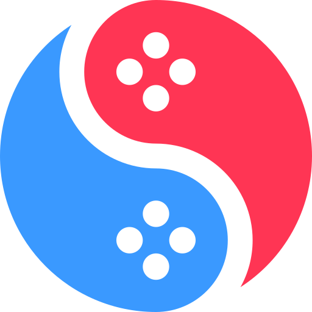

<h1 align="center">
  <br>
  
  <br>
  <b>SUYU-GURecomp</b>
  <br>
</h1>

<h4 align="center">
suyu with AArch32 static recompilation: Monster Hunter Generations Ultimate as a native Windows game.
</h4>

<p align="center">
  <a href="docs/a32recomp/INSTALL.md">Install guide</a> |
  <a href="#status">Status</a> |
  <a href="#building">Building</a> |
  <a href="#license">License</a>
</p>

---

## About

This is a fork of suyu, the Nintendo Switch emulator, which descends from
[Eden](https://git.eden-emu.dev/eden-emu/eden) and yuzu. It adds a **static recompiler for
32-bit ARM (AArch32) games**: suyu's **File → Export Game...** translates the game's code to C
on your PC, compiles it with Microsoft's C++ compiler and links it with suyu's HLE runtime
(OS services, GPU, audio) into one native Windows `.exe`.

The target is **Monster Hunter Generations Ultimate, version 1.4.0**, from your own dump. On
top of the export:

- **Runtime settings** in `game_settings.ini` beside the exe, read at every start, never needing
  a new export: frame rate (30, 60, 90, 120 or auto), resolution and aspect ratio (ultrawide),
  native render resolution, fullscreen, draw distance. Defaults are the original game.
- **F12 panel**: status, controller binding, mod folders and multiplayer.
- **Local multiplayer** over a suyu room (for example through Radmin VPN), host or join from the
  panel or the ini.
- **PC keyboard input** wherever the game asks for text.
- **A drop-in mod host**: a loader DLL such as Forge PC is loaded from the export's `mods` folder,
  with plugins installed by copying files. No new export is needed for mods. The interface is in
  [`src/core/arm/recomp/mod_host_api.h`](src/core/arm/recomp/mod_host_api.h) (MIT).

**No keys, game files or recompiled game code are part of this repository or its releases.**
You need your own Switch keys and your own dump of the game.

The rest of suyu is still here and works as before: it runs as an emulator, and upstream's
experimental AArch64 recompiler path is kept.

## Status

Test builds. The native export is **Windows only** (x64, Visual Studio 2022 17.14 or newer, or Visual Studio 2026),
and **MHGU 1.4.0** is the only title it's tested with. Prebuilt test builds are on the
[releases page](../../releases).

Upstream suyu's Linux and Android build paths are still in the tree, but this fork doesn't
build or test them.

Known issues are listed with each release. Report problems as described in
[INSTALL.md, section 10](docs/a32recomp/INSTALL.md#10-reporting-a-problem).

## Documentation

- [Install and export guide](docs/a32recomp/INSTALL.md): prerequisites step by step, keys,
  exporting, settings, mods, multiplayer, troubleshooting
- [Building from source](docs/a32recomp/BUILDING.md): tools, the build script, release packages,
  where the recompiler code lives
- [Publishing and releases](docs/a32recomp/RELEASE.md): what is never published, licensing
  checklist, release steps

## Building

Windows, with Visual Studio 2022 17.14+, the Vulkan SDK, Qt 6 (MSVC 2022 64-bit, with Qt SVG),
Git and Python 3 installed (details in [BUILDING.md](docs/a32recomp/BUILDING.md)):

```bat
tools\a32recomp\build_windows.bat
```

The result is `build\bin\suyu.exe`. By hand, from an "x64 Native Tools Command Prompt for
VS 2022":

```bat
cmake -S . -B build -G Ninja -DCMAKE_BUILD_TYPE=Release -DENABLE_QT=ON -DYUZU_TESTS=OFF ^
  -DYUZU_USE_BUNDLED_QT=OFF -DCMAKE_PREFIX_PATH=C:\Qt\6.12.0\msvc2022_64
cmake --build build --target suyu suyu-cmd
```

Upstream's notes for other platforms are in [docs/Build.md](docs/Build.md).

## Legal Notice

suyu is a GPLv3 program, which allows free redistribution of its source code and limits its
authors' liability for how the software is used, as stated in sections 15 and 16 of the license.

suyu does not circumvent Nintendo's technological protection measures: the user must provide
both the Nintendo Switch software and the encryption keys for it, which they must lawfully
obtain themselves. suyu decrypts the software with AES, an open standard published by the US
NIST, using those user-provided keys.

suyu was created to reverse engineer the Nintendo Switch software (Horizon OS) for
interoperability between Nintendo Switch games and other operating systems, the purpose
described in section 1201(f) of the DMCA.

This project contains no code or data from Nintendo or Capcom. The recompiler produces the
game's native code on the user's own PC, from the user's own copy; that output must not be
shared. Not affiliated with or endorsed by Nintendo or Capcom. Monster Hunter is a trademark
of Capcom.

## Credits

suyu, Eden and yuzu developers for the emulator this builds on. Public MHGU patches used as
references only, none of their content shipped: 60 FPS by masagrator, 90/120 FPS by minderrx,
pchtxt pack by Fl4sh9174, 16:10 by TLin-Y. Forge by Fexty, which Forge PC ports with permission.

## License

GPL-3.0-or-later. See [LICENSE.txt](LICENSE.txt). Individual files carry SPDX tags; their
license texts are in [LICENSES/](LICENSES).
